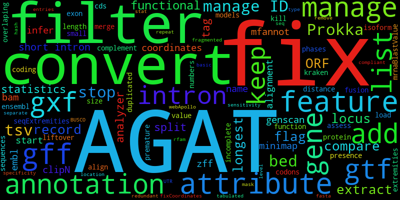

Welcome to AGAT's documentation!
================================

AGAT: Another GTF/GFF Analysis Toolkit
----------------------------------------

**A GFF/GTF toolkit allowing you to perform almost everything you might want to achieve ^^**

The GTF/GFF formats are 9-column text formats used to describe and represent genomic features.
The formats have quite evolved since 1997, and despite well-defined specifications existing nowadays they have a great flexibility allowing holding wide variety of information.
This flexibility has a drawback aspect, there is an incredible amount of flavor of the formats: GFF / GFF1 / GFF2 / GFF2.5 / GFF3 / GTF / GTF2 / GTF2.1 / GTF2.2 / GTF2.5 / GTF3

It's often hard to understand and differentiate all GFF/GTF formats/flavors. Many tools using GTF/GFF formats fails due to specific expectations.
AGAT is a suite of tools able to deal with any GTF/GFF formats and perform most of the possible tasks you would need.

{ width=600px }