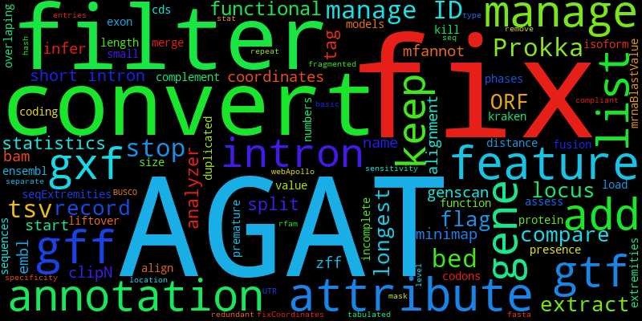

Welcome to AGAT's documentation!
================================

Another GTF/GFF Analysis Toolkit
----------------------------------------

Suite of tools to handle gene annotations in any GTF/GFF format.

Contents
========

.. toctree::
   :maxdepth: 2
   :caption: Contents:

   the_format.md
   why_this_tool.md
   agat_for_you.md
   tools/tools.rst
   topological-sorting-of-gff-features.md
   troubleshooting.md

Indices and tables
==================

* :ref:`genindex`
* :ref:`modindex`
* :ref:`search`
