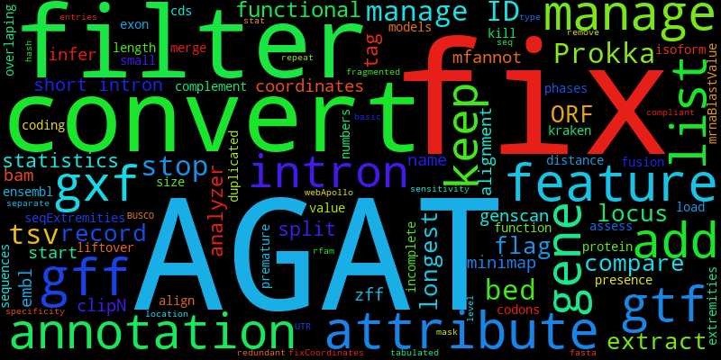

Welcome to AGAT's documentation!
================================

Another GTF/GFF Analysis Toolkit
----------------------------------------

**A GFF/GTF toolkit allowing you to perform almost everything you might want to achieve ^^**

The GTF/GFF formats are 9-column text formats used to describe and represent genomic features.
The formats have quite evolved since 1997, and despite well-defined specifications existing nowadays they have a great flexibility allowing holding wide variety of information.
This flexibility has a drawback aspect, there is an incredible amount of flavor of the formats: GFF / GFF1 / GFF2 / GFF2.5 / GFF3 / GTF / GTF2 / GTF2.1 / GTF2.2 / GTF2.5 / GTF3

It's often hard to understand and differentiate all GFF/GTF formats/flavors. Many tools using GTF/GFF formats fails due to specific expectations.
AGAT is a suite of tools able to deal with any GTF/GFF formats and perform most of the possible tasks you would need.

Contents
========

.. toctree::
   :maxdepth: 2
   :caption: General
   
   agat_for_you.md
   agat_how_does_it_work.md
   troubleshooting.md
   how_to_cite.md
   why_agat.md

.. toctree::
   :maxdepth: 3
   :caption: Knowledge

   gxf.md

.. toctree::
   :maxdepth: 2
   :caption: AGAT vs other tools

   topological-sorting-of-gff-features.md
   gff_to_bed.md
   gff_to_gtf.md

.. toctree::
   :maxdepth: 1
   :caption: List of tools

   tools/agat_convert_bed2gff.md
   tools/agat_convert_embl2gff.md
   tools/agat_convert_genscan2gff.md
   tools/agat_convert_mfannot2gff.md
   tools/agat_convert_minimap2_bam2gff.md
   tools/agat_convert_sp_gff2bed.md
   tools/agat_convert_sp_gff2gtf.md
   tools/agat_convert_sp_gff2tsv.md
   tools/agat_convert_sp_gff2zff.md
   tools/agat_convert_sp_gxf2gxf.md
   tools/agat_sp_Prokka_inferNameFromAttributes.md
   tools/agat_sp_add_introns.md
   tools/agat_sp_add_start_and_stop.md
   tools/agat_sp_alignment_output_style.md
   tools/agat_sp_clipN_seqExtremities_and_fixCoordinates.md
   tools/agat_sp_compare_two_BUSCOs.md
   tools/agat_sp_compare_two_annotations.md
   tools/agat_sp_complement_annotations.md
   tools/agat_sp_ensembl_output_style.md
   tools/agat_sp_extract_attributes.md
   tools/agat_sp_extract_sequences.md
   tools/agat_sp_filter_by_ORF_size.md
   tools/agat_sp_filter_by_locus_distance.md
   tools/agat_sp_filter_by_mrnaBlastValue.md
   tools/agat_sp_filter_feature_by_attribute_presence.md
   tools/agat_sp_filter_feature_by_attribute_value.md
   tools/agat_sp_filter_feature_from_keep_list.md
   tools/agat_sp_filter_feature_from_kill_list.md
   tools/agat_sp_filter_gene_by_intron_numbers.md
   tools/agat_sp_filter_gene_by_length.md
   tools/agat_sp_filter_incomplete_gene_coding_models.md
   tools/agat_sp_filter_record_by_coordinates.md
   tools/agat_sp_fix_cds_phases.md
   tools/agat_sp_fix_features_locations_duplicated.md
   tools/agat_sp_fix_fusion.md
   tools/agat_sp_fix_longest_ORF.md
   tools/agat_sp_fix_overlaping_genes.md
   tools/agat_sp_fix_small_exon_from_extremities.md
   tools/agat_sp_flag_premature_stop_codons.md
   tools/agat_sp_flag_short_introns.md
   tools/agat_sp_functional_statistics.md
   tools/agat_sp_gxf_to_gff3.md
   tools/agat_sp_keep_longest_isoform.md
   tools/agat_sp_kraken_assess_liftover.md
   tools/agat_sp_list_short_introns.md
   tools/agat_sp_load_function_from_protein_align.md
   tools/agat_sp_manage_IDs.md
   tools/agat_sp_manage_UTRs.md
   tools/agat_sp_manage_attributes.md
   tools/agat_sp_manage_functional_annotation.md
   tools/agat_sp_manage_introns.md
   tools/agat_sp_merge_annotations.md
   tools/agat_sp_prokka_fix_fragmented_gene_annotations.md
   tools/agat_sp_sensitivity_specificity.md
   tools/agat_sp_separate_by_record_type.md
   tools/agat_sp_split_by_level2_feature.md
   tools/agat_sp_statistics.md
   tools/agat_sp_to_tabulated.md
   tools/agat_sp_webApollo_compliant.md
   tools/agat_sq_add_attributes_from_tsv.md
   tools/agat_sq_add_hash_tag.md
   tools/agat_sq_add_locus_tag.md
   tools/agat_sq_keep_annotation_from_fastaSeq.md
   tools/agat_sq_list_attributes.md
   tools/agat_sq_manage_ID.md
   tools/agat_sq_manage_IDs.md
   tools/agat_sq_manage_attributes.md
   tools/agat_sq_mask.md
   tools/agat_sq_remove_redundant_entries.md
   tools/agat_sq_repeats_analyzer.md
   tools/agat_sq_rfam_analyzer.md
   tools/agat_sq_split.md
   tools/agat_sq_stat_basic.md

Indices and tables
==================

* :ref:`genindex`
* :ref:`search`
