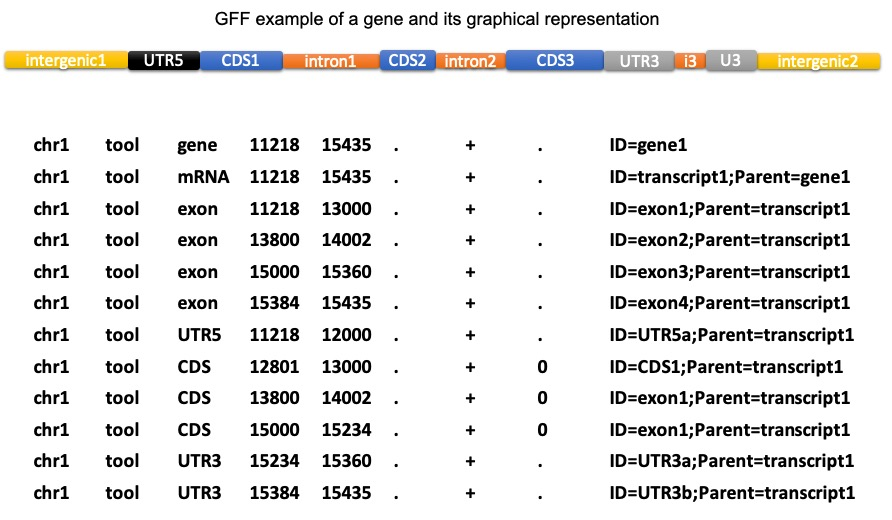

# agat\_sp\_extract\_sequences.pl

## Briefly in pictures




## DESCRIPTION

This script extracts sequences in fasta format according to features described
in a gff file. You can extract the fasta of any type of feature. The feature
type is defined within the 3rd column in the gff file.
The result is written to the specified output file, or to STDOUT.

Features spanning several locations (e.g. UTR, CDS), are extracted chunk by chunk
and merged to create the biological feature. If you wish to extract each chunck independently,
please refer to the --split parameter. To see the list of features that may span over several locations
within AGAT run: agat\_convert\_sp\_gxf2gxf.pl --expose
and then look at the file called features\_spread.json.

The headers are formated like that:
\>ID gene=gene\_ID name=NAME seq\_id=Chromosome\_ID type=cds 5'extra=VALUE

The ID is the identifier of the feature (ID attribute in the 9th column.
If missing it is created by AGAT)
The gene value will be the ID of the level1 feature (the top feature of the record)
The name value is optional and will be written only if the Name attribute exists in the gff.
The seq\_id value is the value from 1st column within the gff.
The type value holds the information of the feature type extracted.
5'extra or 3'extra is optional, it holds the information of extra nucleotides
removed or added when using the downstream and/or upstream parameter.

The OFS of all values can be modified excepted for the ID (see --ofs parameter).
In such case the tool gives a warning.

**Some examples:**  
To extract the coding regions:  
```
agat_sp_extract_sequences.pl -g infile.gff -f infile.fasta
# or
agat_sp_extract_sequences.pl -g infile.gff -f infile.fasta -t cds
```
To extract and translate the coding regions:  
```
agat_sp_extract_sequences.pl -g infile.gff -f infile.fasta -p
# or
agat_sp_extract_sequences.pl -g infile.gff -f infile.fasta -t cds -p
```
To extract the mRNA (biological definition UTR+CDS):  
```
agat_sp_extract_sequences.pl -g infile.gff -f infile.fasta -t exon --merge
```
To extract each cds chunk independently:  
```
agat_sp_extract_sequences.pl -g infile.gff -f infile.fasta -t cds --split
```
To extract 5'UTR with introns:  
```
agat_sp_extract_sequences.pl -g infile.gff -f infile.fasta -t "5'UTR" --full
```
To extract 100nt upstream region of a gene:  
```
agat_sp_extract_sequences.pl -g infile.gff -f infile.fasta -t gene --upstream 100
```
General usage:  
```
agat_sp_extract_sequences.pl -g infile.gff -f infile.fasta  [ -o outfile ]
agat_sp_extract_sequences.pl --help
```

## OPTIONS

- **--alternative\_start\_codon** or **--asc**

    Bolean - When activated it can affect the translation of the start codon.
    Indeed alternative start codons exist, and are translated by the cells'machinery
    by a Methionine (M). By default AGAT translates the first codon as other codons by the
    corresponding AA. If you wish to translate the first codon by a M when it is a valid
    alternative start codon, activate this parameter.
    If the sequence you try to translate is a CDS (or starting by a CDS), the phase
    is checked and the alternative start codon is accepted only if the phase is 0.

- **--cdna**

    Boolean - This extract the cdna sequence (i.e reverse complement of the mRNA:
    transcribed sequence (devoid of introns, but containing untranslated exons,
    then reverse complemented). It corresponds to extract the exons sequences,
    merge them, and reverse complement the sequence (--type exon --merge --revcomp).

- **--clean\_final\_stop** or **--cfs**

    Boolean - The Clean Final Stop option allows removing the translation of the
    final stop codons that is represented by the <\*> character.
    This character can be disturbing for many programs (e.g interproscan)

- **--clean\_internal\_stop** or **--cis**

    Boolean - The Clean Internal Stop option allows replacing the translation of the
    stop codons present among the sequence that is represented by the <\*> character
    by <X>. Indeed the <\*> character can be disturbing for many programs
    (e.g interproscan)

- **--codon**, **--table** or **--ct**

    Integer - Allow to choose the codon table for the translation. \[default 1\]

- **--do**, **-3**, **--three**, **-down** or **-downstream**

    Integer - It will take that number of nucleotide in more at the 3' extremity.
    /!\\ You must activate the option "--full" if you with to extract only the most downstream part of certain feature (exon,cds,utr)
    otherwise you will extract each downstream parts of the subfeatures (e.g many cds parts may be needed to shape a cds in its whole).

- **--eo**

    Boolean - Called 'extremity only', this option will extract only the adjacent parts of a feature.
    This option has to be activated with -u and/or -p option.
    /!\\ using -u and -p together builds a chimeric sequence which will be the concatenation of the left and right extremities of a feature.

- **-f** or **--fasta**

    String - Input fasta file.

- **--full**

    Boolean - This option allows dealing with feature that may span over several locations
    like cds or exon, in order to extract the full sequence from the start extremity
    of the first chunck to the end extremity of the last chunk.
    The use of that option with '--type exon' will extract the pre-mRNA sequence (i.e with introns).
    Use of that option on cds will give the pre-mRNA without the untraslated regions (UTRs).
    (To extract an mRNA as it is defined biologicaly you need to use the
    \`-t exon\` option with the --merge option)

- **-g**, **--gff** or **-ref**

    String - Input GTF/GFF file.

- **-c** or **--config**

    String - Input agat config file. By default AGAT takes as input agat_config.yaml file from the working directory if any,
    otherwise it takes the orignal agat_config.yaml shipped with AGAT. To get the agat_config.yaml locally type: "agat config --expose".
    The --config option gives you the possibility to use your own AGAT config file (located elsewhere or named differently).

- **-h** or **--help**

    Boolean - Display this helpful text.

- **--keep_attributes**

    Boolean - The value of the attribute tags will be extracted from the feature type
    specified by the option --type and stored in the fasta header.

- **--keep_parent_attributes**

    Boolean - The value of the attribute tags will be extracted from the feature type
    specified by the option --type along with those from parent features and stored in the fasta header.

- **--merge**

    Boolean - By default, only features that span several locations (e.g. cds and utr can
    span over several exons) are merged together. In order to merge other
    type of features (e.g. exon) you must activate this parameter.

- **--mrna**

    Boolean - This extract the mrna sequence (i.e transcribed sequence (devoid of
    introns, but containing untranslated exons)). It corresponds to extract the exon
    sequences and merge them (--type exon --merge).

- **--ofs**

    String - Output Fields Separator for the description field of the header of the
    created fasta sequences. By default it's a space < > but can be modified by any String or
    character using this option.

- **-o** or **--output**

    String - Output fasta file.  If no output file is specified, the output will be
    written to STDOUT.

- **--plus\_strand\_only**

    Boolean - By default the extrated feature sequences from a minus strand is
    reverse complemented. Activating this option you will always get sequence from plus
    strand ( not reverse complemented).
    You can get the opposite (minus strand only) by using --plus\_strand\_only --revcomp

- **-p**, **--protein** or **--aa**

    Boolean - Will translate the extracted sequence in Amino acid.
    By default the codon table used is the 1 (Standard).
    See --table parameter for more options.

- **--remove\_orf\_offset** or **--roo**

    Boolean - CDS can start with a phase different from 0 when a gene model is fragmented.
    When asking for protein translation this (start) offset is trimmed out automatically.
    But when you extract CDS dna sequences, this  (start) offset is not removed by default.
    To remove it activate this option. If --up or --do option are used too, the (start) offset
    is trimmed first, then is added the piece of sequence asked for.

- **--revcomp**

    Boolean - To reverse complement the extracted sequence \[default - False\].
    By default the extrated feature sequences from a minus strand is
    reverse complemented. Consequently, for minus strand features that option will
    extract the sequences from plus strand from left to right.

- **--split**

    Boolean -  By default, all features that span several locations
    (e.g. cds and utr can span over several exons) are merge together to shape
    the biological feature (e.g. several cds chuncks are merged to create the CDS
     in its whole).
    If you wish to extract all the chuncks independently activate this option.

- **-t** or **--type**

    String - Define the feature you want to extract the sequence from.
    Default 'cds'.
    Most common choice are: gene,mrna,exon,cds,trna,three\_prime\_utr,five\_prime\_utr.
    When you choose exon (or cds,utr,etc.), all the exons of a same parent feature
    are attached together before to extract the sequence. If you wish to extract each
    exon of an mRNA independently, see option --split.
    /!\\ \`-t mRNA\` will extract the features labeled as "mRNA" and corresponds to the cdna\*
    because it contains the introns if any. It does not actually extract the mRNAs as
    it is defined biologicaly. To extract the mRNA as defined biologicaly you must use \`-t exon\`.
    \*Not a real cdna because it is not reversed

- **--up**, **-5**, **--five** or **-upstream**

    Integer - It will take that number of nucleotide in more at the 5' extremity.
    /!\\ You must activate the option "--full" if you wish to extract only the most
    upstream part of certain features (exon,cds,utr)
    otherwise you will extract each upstream parts of the subfeatures
    (e.g many cds parts may be needed to shape a cds in its whole).
